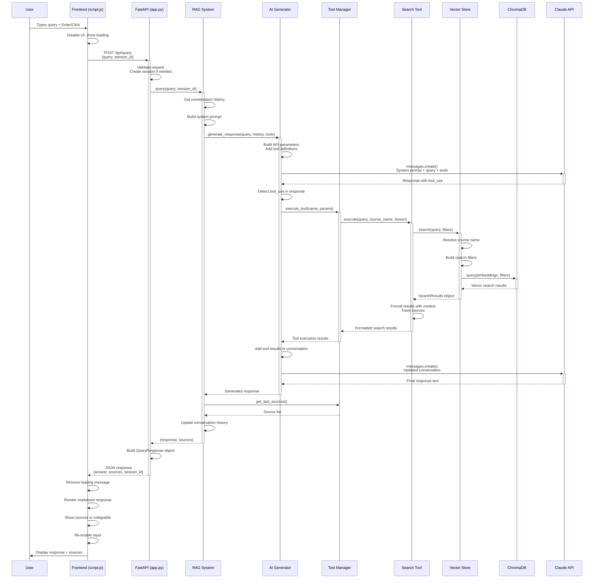
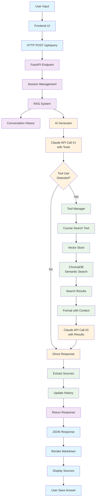
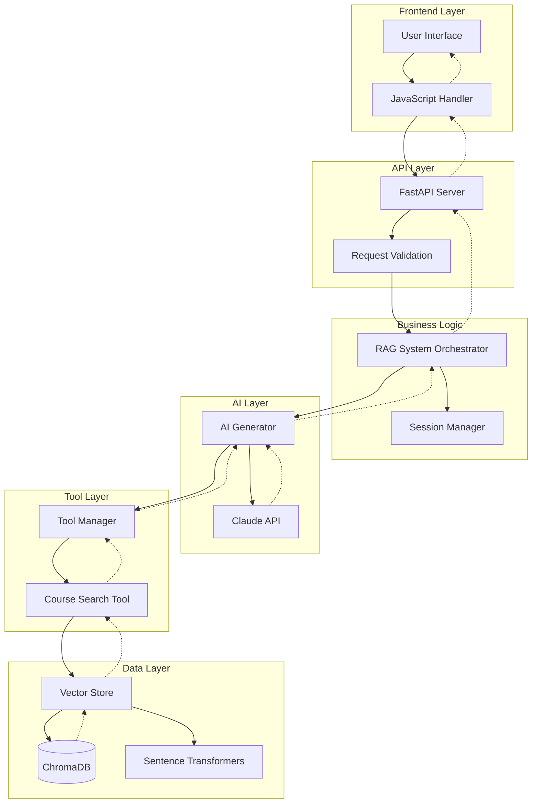

# RAG System Query Flow Diagram

```mermaid
sequenceDiagram
    participant U as User
    participant FE as Frontend (script.js)
    participant API as FastAPI (app.py)
    participant RAG as RAG System
    participant AI as AI Generator
    participant TM as Tool Manager
    participant ST as Search Tool
    participant VS as Vector Store
    participant DB as ChromaDB
    participant Claude as Claude API

    %% User initiates query
    U->>FE: Types query + Enter/Click
    FE->>FE: Disable UI, show loading
    
    %% Frontend to backend
    FE->>+API: POST /api/query<br/>{query, session_id}
    API->>API: Validate request<br/>Create session if needed
    
    %% RAG orchestration
    API->>+RAG: query(query, session_id)
    RAG->>RAG: Get conversation history
    RAG->>RAG: Build system prompt
    
    %% AI generation with tools
    RAG->>+AI: generate_response(query, history, tools)
    AI->>AI: Build API parameters<br/>Add tool definitions
    
    %% First Claude call
    AI->>+Claude: messages.create()<br/>System prompt + query + tools
    Claude-->>-AI: Response with tool_use
    
    %% Tool execution flow
    AI->>AI: Detect tool_use in response
    AI->>+TM: execute_tool(name, params)
    TM->>+ST: execute(query, course_name, lesson)
    
    %% Vector search
    ST->>+VS: search(query, filters)
    VS->>VS: Resolve course name
    VS->>VS: Build search filters
    VS->>+DB: query(embeddings, filters)
    DB-->>-VS: Vector search results
    VS-->>-ST: SearchResults object
    
    %% Format results
    ST->>ST: Format results with context<br/>Track sources
    ST-->>-TM: Formatted search results
    TM-->>-AI: Tool execution results
    
    %% Final Claude call
    AI->>AI: Add tool results to conversation
    AI->>+Claude: messages.create()<br/>Updated conversation
    Claude-->>-AI: Final response text
    AI-->>-RAG: Generated response
    
    %% Session management
    RAG->>TM: get_last_sources()
    TM-->>RAG: Source list
    RAG->>RAG: Update conversation history
    RAG-->>-API: (response, sources)
    
    %% Response back to frontend
    API->>API: Build QueryResponse object
    API-->>-FE: JSON response<br/>{answer, sources, session_id}
    
    %% UI update
    FE->>FE: Remove loading message
    FE->>FE: Render markdown response
    FE->>FE: Show sources in collapsible
    FE->>FE: Re-enable input
    FE->>U: Display response + sources
```

## Key Components Flow

```mermaid
flowchart TD
    %% User interaction
    A[User Input] --> B[Frontend UI]
    
    %% Frontend processing
    B --> C[HTTP POST /api/query]
    
    %% Backend entry
    C --> D[FastAPI Endpoint]
    D --> E[Session Management]
    
    %% RAG orchestration
    E --> F[RAG System]
    F --> G[Conversation History]
    F --> H[AI Generator]
    
    %% AI processing
    H --> I[Claude API Call #1<br/>with Tools]
    I --> J{Tool Use<br/>Detected?}
    
    %% Tool execution path
    J -->|Yes| K[Tool Manager]
    K --> L[Course Search Tool]
    L --> M[Vector Store]
    M --> N[ChromaDB<br/>Semantic Search]
    N --> O[Search Results]
    O --> P[Format with Context]
    P --> Q[Claude API Call #2<br/>with Results]
    
    %% Direct response path
    J -->|No| R[Direct Response]
    Q --> R
    
    %% Response processing
    R --> S[Extract Sources]
    S --> T[Update History]
    T --> U[Return Response]
    
    %% Frontend display
    U --> V[JSON Response]
    V --> W[Render Markdown]
    W --> X[Display Sources]
    X --> Y[User Sees Answer]
    
    %% Styling
    classDef frontend fill:#e1f5fe
    classDef backend fill:#f3e5f5
    classDef ai fill:#fff3e0
    classDef data fill:#e8f5e8
    
    class A,B,C,V,W,X,Y frontend
    class D,E,F,G,U backend
    class H,I,J,Q,R ai
    class K,L,M,N,O,P,S,T data
```

## Data Flow Architecture

```mermaid
graph TB
    subgraph "Frontend Layer"
        UI[User Interface]
        JS[JavaScript Handler]
    end
    
    subgraph "API Layer"
        FastAPI[FastAPI Server]
        Validation[Request Validation]
    end
    
    subgraph "Business Logic"
        RAGSys[RAG System Orchestrator]
        SessionMgr[Session Manager]
    end
    
    subgraph "AI Layer"
        AIGen[AI Generator]
        Claude[Claude API]
    end
    
    subgraph "Tool Layer"
        ToolMgr[Tool Manager]
        SearchTool[Course Search Tool]
    end
    
    subgraph "Data Layer"
        VectorStore[Vector Store]
        ChromaDB[(ChromaDB)]
        Embeddings[Sentence Transformers]
    end
    
    %% Flow connections
    UI --> JS
    JS --> FastAPI
    FastAPI --> Validation
    Validation --> RAGSys
    RAGSys --> SessionMgr
    RAGSys --> AIGen
    AIGen --> Claude
    AIGen --> ToolMgr
    ToolMgr --> SearchTool
    SearchTool --> VectorStore
    VectorStore --> ChromaDB
    VectorStore --> Embeddings
    
    %% Response flow (simplified)
    ChromaDB -.-> VectorStore
    VectorStore -.-> SearchTool
    SearchTool -.-> ToolMgr
    ToolMgr -.-> AIGen
    Claude -.-> AIGen
    AIGen -.-> RAGSys
    RAGSys -.-> FastAPI
    FastAPI -.-> JS
    JS -.-> UI
```